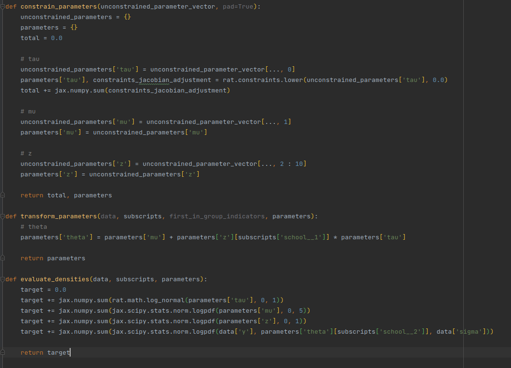
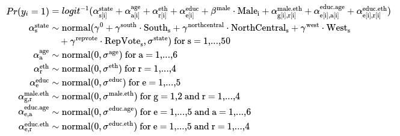
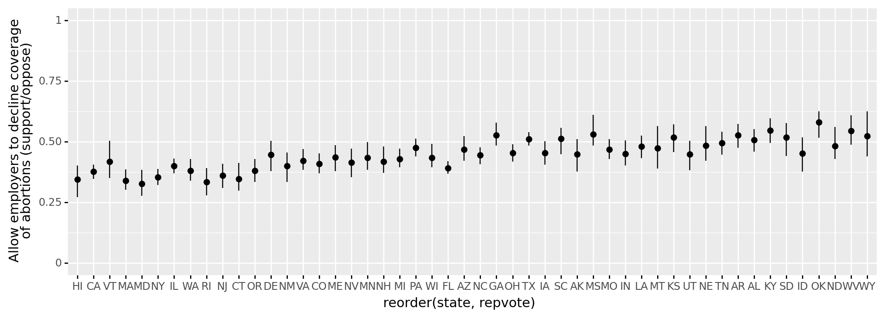

```{r setup, include=FALSE}
knitr::opts_chunk$set(echo = FALSE)
```

## Table of contents

- Light introduction to Bayesian modeling and multilevel regression models
  + Simple regression
  + Multilevel regression
- Some Example Models
  + Eightschools
  + Games
  + MRP

- Model Specification
  + Stan
  + lme4/brms
  + Rat

- Limitations
  + Conditional statements
  + Functions and recursion
  + Non-scalar parameters

- Overview of language pipeline

- Future Plans
  + River Rat
  + Python Integration
  + Predictions and Calibration

## Bayesian Regression Models

Standard linear regression:
$$
y_n = \alpha + \beta x + \epsilon
$$
Bayesian linear regression:
$$
\begin{aligned}
y &\sim \mathrm{normal}(\mu, \sigma) \\
\mu &= \alpha + \beta x \\
\alpha &\sim \mathrm{normal}(0, 1) \\
\beta &\sim \mathrm{normal}(0, 1) \\
\sigma &\sim \mathrm{beta}(2, 1) \\
\end{aligned}
$$

## Multilevel Models
Add some explanation here


## Multilevel Models - Groups
- Turns out "multilevel" regressions are about parameters which exist for each memebers in a group(gender, ethnicity, region, etc.)
- 

## Introducing Rat
Specify models through sampling and assignment statements
$$
\begin{aligned}
\text{score_diff} &\sim \mathrm{normal}(s_{home\_team} - s_{away\_team}, \sigma) \\
s_{team} &= z_{team} \times \tau \\
z_{team} &\sim \mathrm{normal}(0, 1) \\
\tau &\sim \mathrm{normal}(0, 1) \\
\sigma &\sim \mathrm{normal}(0, 1)
\end{aligned}
$$

This gets written in Rat as:
```
score_diff' ~ normal(skill[home_team] - skill[away_team], sigma);
skill[team]' = skill_z[team] * tau;
skill_z ~ normal(0.0, 1.0);
tau<lower = 0.0> ~ normal(0.0, 1.0);
sigma ~ normal(0.0, 1.0);
```

## Exmample Model - Eightschools
- Classic example from BayesStats literature
- Test scores for $J$ different schools
- Mean of test scores for schools follow a shared distribution $\mathrm{normal}(\mu, \tau)$
$$
\begin{aligned}
y &\sim \mathrm{normal}(\theta_{school}, \sigma) \\
\theta &\sim \mathrm{normal}(\mu, \tau); \\
\mu &\sim \mathrm{normal}(0, 5) \\
\tau &\sim \mathrm{lognormal}(0, 1)
\end{aligned}
$$


## Example Model - Eightschools
- Hierarchical models normally include highly correlated parameters
- Highly correlated parameters create a "funnel" posterior, hindering sampling
- Reparameterize to relieve correlation:
$$
\begin{aligned}
y &\sim \mathrm{normal}(\theta_{school}, \sigma) \\
\theta_{school} &= \mu + z_{school} \times \tau \\
\mu &\sim \mathrm{normal}(0, 5) \\
\tau &\sim \mathrm{lognormal}(0, 1)
\end{aligned}
$$
## Example Model - Eightschools
In Stan:
```
data {
  int <lower=0> J;
  real y[J];
  real<lower=0> sigma[J];
}
parameters {
  vector[J] z;
  real mu;
  real<lower=0> tau;
}
transformed parameters{
  vector[J] theta;
  theta=z*tau+mu;
}
model {
  z ~ log_normal(0,1);
  y ~ normal(theta , sigma);
  mu ~ normal(0, 5);
  tau ~ cauchy(0, 5);
}
```

## Example Model - Eightschools
In Rat:
```
y' ~ normal(theta[school], sigma);
theta' = mu + z[school] * tau;
z ~ normal(0, 1);
mu ~ normal(0, 5);
tau<lower = 0.0> ~ log_normal(0, 1);
```

## Example Model - Eightschools
- Rat transform the model into a Python module which defines two important functions
  + Log probability evaluation
  + Parameter un-constraning and transformation




## Example Model - MRP
- Modeling survey response to “Allow employers to decline coverage of abortions in insurance plans (Support / Oppose)”

## Example Model - MRP


## Example Model - MRP
- Note how `lme4` syntax allows simple specifications of group-level variables.
```
fit <- stan_glmer(abortion ~ (1 | state) + (1 | eth) + (1 | educ) + male +
                    (1 | male:eth) + (1 | educ:age) + (1 | educ:eth) +
                    repvote + factor(region),
  family = binomial(link = "logit"),
  data = cces_df,
  prior = normal(0, 1, autoscale = TRUE),
  prior_covariance = decov(scale = 0.50),
  adapt_delta = 0.99,
  refresh = 0,
  seed = 1010)
```

## Example Model - MRP
- Quite Complex!
```
allow_decline_coverage ~ bernoulli_logit(
    b_repvote * repvote' +
    b_male * male +
    a_state[state, region] +
    a_age[age] +
    a_eth[eth] +
    a_educ[educ] +
    a_male_eth[male, eth] +
    a_educ_age[educ, age] +
    a_educ_eth[educ, eth]
);

a_state[state, region]' = a_region[region] + a_state_z[state, region] * sigma_state;
a_age[age]' = a_age_z[age] * sigma_age;
a_eth[eth]' = a_eth_z[eth] * sigma_eth;
a_educ[educ]' = a_educ_z[educ] * sigma_educ;
a_male_eth[male, eth]' = a_male_eth_z[male, eth] * sigma_male_eth;
a_educ_age[educ, age]' = a_educ_age_z[educ, age] * sigma_educ_age;
a_educ_eth[educ, eth]' = a_educ_eth_z[educ, eth] * sigma_educ_eth;

a_region[region] ~ normal(0.0, 5.0);
b_repvote ~ normal(0.0, 5.0);
b_male ~ normal(0.0, 5.0);

a_state_z[state, region] ~ normal(0.0, 1.0);
a_age_z[age] ~ normal(0.0, 1.0);
a_eth_z[eth] ~ normal(0.0, 1.0);
a_educ_z[eth] ~ normal(0.0, 1.0);
a_male_eth_z[male, eth] ~ normal(0.0, 1.0);
a_educ_age_z[educ, age] ~ normal(0.0, 1.0);
a_educ_eth_z[educ, eth] ~ normal(0.0, 1.0);

sigma_state<lower = 0.0> ~ log_normal(0.0, 1.0);
sigma_age<lower = 0.0> ~ log_normal(0.0, 1.0);
sigma_eth<lower = 0.0> ~ log_normal(0.0, 1.0);
sigma_educ<lower = 0.0> ~ log_normal(0.0, 1.0);
sigma_male_eth<lower = 0.0> ~ log_normal(0.0, 1.0);
sigma_educ_age<lower = 0.0> ~ log_normal(0.0, 1.0);
sigma_educ_eth<lower = 0.0> ~ log_normal(0.0, 1.0);

```

## Example Model - MRP
Resulting plot created from parameters inferred by Rat:

Resulting plot 

## Rat Pipeline
- Input: Rat model text
- Compiler output: Python script which defines functions for log density calculation and parameter transformation
- Execution involves running NUTS with the defined functions
- Call JAX to JIT-compile the model for faster execution


## Rat Internals: JAX
- Python package for autodiff and JIT compilation
- HMC requires derivatives of target density with respect to parameters
- JIT: just in time compilation
  + "Transpile" python code to C++ that uses XLA(fast routines for vectorized numerical calculations)


## Rat Internals: NUTS
- No U-turn sampler for HMC
- Written as a Python extension in Rust, by Ben
- Result: no nasty Python loops involved!


## Identifying Parameter Domains
- Parameters are declared by use
- Need to identify which subscript factors should parameters exist for

## Identifying Parameter Domains - Dataframe Manipulation
- Parameter dataframes are transformations of input dataframe columns
- We can figure out a dependency relation between dataframes of parameters
- The 'data' dataframe isn't dependent on any other dataframes, which serves as our starting point
- tarting from data dataframes, manipulate the dataframe as parameters gets used
- Problems: 
  + Quite complicated to wrap your head around
  + Need multiple code passes

## Identifying Parameter Domains - Functional Approach
- Treat parameters as functions
- arguments: subscripts
- output: scalar value of parameter corresponding to argument subscripts
- Problems changes into identifying what arguments were passed to the function
- Run some iterations of the program, tracing what arguments were supplied.

## Taking the functional perspective further - Fully functional Rat (River Rat)
- Axe statements
- `let` defines a variables within a scope

## Predictions
- Sometimes interested in performing predictions for new data, using inferred parameter values
- Cross-validation can also be useful
- Design an interface which lets you run a Rat model with new data, using already fitted parameter values


## Calibration
- "Calibration" in Bayesian inference means checking if inference was done correctly
- There exists some nice properties we can check that hold for well-calibrated models
- Such checks require rewriting the model and preparations(simulating data from the model)
- Design an interface which can perform such checks given a Rat model and data(or even without any data!)

## References
- MRP